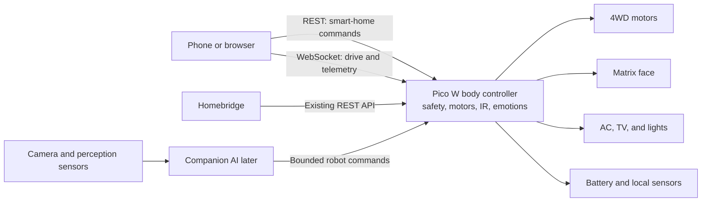

# Brobot Project Plan

## 1. Goal

Brobot will combine two currently separate capabilities:

1. The Freenove ordinary-wheel 4WD robot body: motors, battery measurement,
   servo, buzzer, RGB LEDs, tracking sensors, IR receiver, and front sensor or
   matrix module.
2. The existing Pico W room controller: Fujitsu AC IR control, ceiling-light
   control, TV remote learning, Apple HomeKit integration through Homebridge,
   a web dashboard, mDNS, EEPROM persistence, and OTA updates.

The result should first be a reliable, remotely driven room robot. Later, a
separate companion module can provide camera perception and AI planning while
the Pico W continues to enforce local safety.

## 2. Product principles

- **The Pico W owns the hardware.** Motors, PWM, battery limits, infrared,
  expressions, and emergency stopping stay on the Pico W.
- **AI is a bounded client.** A future AI module may request motion or an
  expression through the same documented API as any other controller. It may
  not write GPIO, bypass limits, or flash firmware.
- **Loss of communication means stop.** A stale command, disconnected client,
  Wi-Fi failure, mode transition, OTA update, or fault must leave the motors
  stopped.
- **Smart-home behavior remains local.** Existing REST and Homebridge behavior
  should continue to work without a cloud dependency.
- **Remote means LAN first.** The Pico W must not be directly exposed to the
  public internet. Out-of-home access will require an authenticated gateway or
  VPN.
- **Build safety before autonomy.** Manual control, stopping behavior, power,
  and telemetry must be proven before adding AI navigation.

## 3. Proposed architecture



### Pico W responsibilities

- Motor PWM and left/right drive mixing.
- Speed, acceleration, and command-duration limits.
- Dead-man timeout and emergency stop.
- Control-mode state machine.
- Battery monitoring and low-voltage response.
- IR transmission and learning.
- Matrix emotions and RGB status lights.
- Smart-home REST API, local dashboard, mDNS, and OTA.
- Low-rate telemetry for clients.

### Companion-module responsibilities, later

- Camera capture and video streaming.
- Object detection, speech, navigation, mapping, and planning.
- Selecting a bounded action such as drive, rotate, stop, or express emotion.
- Maintaining higher-level context without becoming a motor controller.

Video should travel directly from the companion module to the user or AI
process. It should not be routed through the Pico W.

## 4. Hardware compatibility

The current room-controller pins align well with the Freenove board.

| Function | Current room controller | Freenove car | Plan |
|---|---:|---:|---|
| IR transmitter | GP15 | Not used by the main car functions | Keep GP15 and the transistor-driven IR LED |
| IR receiver | GP3 | GP3 | Reuse the car receiver if its range is sufficient |
| Light sensors | GP27 and GP28 | GP27 and GP28 | Reuse the onboard sensors and recalibrate thresholds |
| Right motors | - | GP6 through GP9 | Add ordinary-wheel motor driver |
| Left motors | - | GP18 through GP21 | Add ordinary-wheel motor driver |
| Battery measurement | - | GP26 | Add voltage telemetry and low-voltage policy |
| Buzzer | - | GP2 | Use for arming, warning, and fault sounds |
| Servo | - | GP13 | Reserve for a future camera or sensor pan axis |
| RGB LEDs | - | GP16 | Use for status, turn signals, and fault indication |
| Tracking sensors | - | GP10 through GP12 | Leave optional in the first milestone |
| Matrix | - | I2C on GP4 and GP5, address `0x71` | Use for robot emotions |
| Ultrasonic sensor | - | Trigger GP4, echo GP5 | Conflicts with the matrix in the stock wiring |

### Matrix and ultrasonic decision

Freenove's stock multi-function firmware probes I2C address `0x71`. When the
matrix is present, GP4 and GP5 are used as I2C. When it is absent, those same
pins are initialized for the ultrasonic sensor. The stock arrangement therefore
treats the modules as alternatives.

The first Brobot version will use the matrix. Local collision protection can
later use one of these options:

- Rewire the ultrasonic sensor to other accessible GPIO.
- Add an I2C time-of-flight sensor that can share the matrix bus.
- Add a simple physical bumper switch.

The ultrasonic sensor is not rich enough for autonomous perception, but a
simple sensor can still be valuable as a last-resort local stop mechanism.

## 5. Network interfaces

### Existing REST API

The smart-home endpoints remain HTTP REST because AC, TV, and light operations
are infrequent. Backward compatibility with the existing dashboard and
Homebridge configuration is a requirement.

State-changing operations should eventually move from unauthenticated `GET`
requests to a safer authenticated design where Homebridge compatibility allows
it. That is separate from the initial robot-control milestone.

### WebSocket control channel

Manual driving and robot telemetry will use a persistent WebSocket connection.
This works from browsers and is more appropriate than repeated HTTP requests
for a joystick.

The Freenove TCP command server is useful as a hardware reference, but it will
not be reused as the final network architecture. Its connected-client loop is
blocking, it has no controller lease or command expiry, and its disconnect path
does not explicitly stop the motors.

Example drive command:

```json
{
  "type": "drive",
  "seq": 42,
  "linear": 0.4,
  "angular": -0.2,
  "ttl_ms": 300
}
```

`linear` and `angular` are normalized values from `-1.0` to `1.0`. The Pico W
will mix them into left and right motor commands, constrain the result, and
apply a configurable slew rate.

Other initial commands:

```json
{ "type": "stop", "seq": 43 }
{ "type": "arm", "mode": "manual" }
{ "type": "emotion", "name": "curious", "ttl_ms": 2000 }
{ "type": "ping", "client_time_ms": 123456 }
```

Example telemetry:

```json
{
  "type": "state",
  "mode": "manual",
  "armed": true,
  "battery_v": 7.8,
  "linear": 0.4,
  "angular": -0.2,
  "emotion": "moving",
  "rssi": -54,
  "faults": []
}
```

JSON is acceptable for the first version. A compact binary protocol should
only be considered if measurement shows that JSON is a real limitation.

## 6. Control modes

The firmware will expose an explicit state machine:

- `DISARMED`: motors cannot move; default after boot.
- `MANUAL`: one authenticated controller owns a short-lived control lease.
- `ASSISTED`: manual commands may be limited by local safety sensors.
- `AUTONOMOUS`: a companion module may issue bounded motion commands.
- `FAULT`: motors are stopped and movement commands are rejected.

Transitions into `ASSISTED` or `AUTONOMOUS` must be explicit. A client must not
be able to silently change modes merely by sending a drive command.

Manual stop, a physical kill switch, low battery, and faults override every
other mode.

## 7. Mandatory safety requirements

These are release requirements, not optional enhancements:

- Initialize every motor output to stopped before networking starts.
- Stop when no valid drive refresh arrives within 300 to 500 milliseconds.
- Stop immediately when the active controller disconnects.
- Stop on Wi-Fi loss, mode transition, parse failure, or invalid command.
- Stop before starting an OTA update or reboot.
- Stop before executing a potentially blocking smart-home IR transmission.
- Begin testing with the wheels lifted and a 25 to 35 percent speed cap.
- Limit acceleration and deceleration to reduce current spikes and tipping.
- Allow only one active controller lease.
- Reject out-of-order sequence numbers where practical.
- Cap command TTL and ignore values outside documented ranges.
- Provide a large stop control in the web interface.
- Preserve a physical power or motor kill switch.
- Enter `FAULT` or a restricted mode below the selected battery threshold.
- Never accept unauthenticated motor commands from the public internet.

The RP2040 hardware watchdog may recover a wedged firmware process, but motor
stopping must not depend only on a full-system watchdog reset.

## 8. Emotion system

Clients request semantic emotions instead of arbitrary matrix pixels. The Pico
W owns animation timing and priority.

Initial vocabulary:

- `idle`
- `listening`
- `thinking`
- `curious`
- `happy`
- `confused`
- `moving`
- `low_battery`
- `disconnected`
- `fault`

Priority order:

1. `fault` and critical battery state.
2. Disconnected or disarmed status.
3. Motion or active-operation status.
4. A temporary emotion requested by a controller or AI module.
5. Idle animation.

This prevents an AI-requested smile from hiding a safety warning.

## 9. Firmware structure

The current room-controller sketch is large and should not become a larger
single-file sketch. The implementation should move toward this separation:

```text
firmware/
  brobot.ino
  config.example.h
  body/
    motors.cpp
    motors.h
    safety.cpp
    safety.h
    battery.cpp
    battery.h
    emotions.cpp
    emotions.h
  smarthome/
    ac_ir.cpp
    ac_ir.h
    lights.cpp
    lights.h
    tv_ir.cpp
    tv_ir.h
  network/
    rest_api.cpp
    rest_api.h
    websocket_control.cpp
    websocket_control.h
  web/
    dashboard.h
```

Exact file boundaries may change during implementation. The important rule is
that networking, motor safety, expressions, and smart-home protocols are not
interleaved in one event loop.

Core 1 currently handles IR reception. That can remain initially. Core 0 will
service networking and the body-control tick, but blocking operations must not
be allowed while the robot is moving.

## 10. Delivery roadmap

### Phase 0: integration baseline

- Establish the firmware project and dependency versions.
- Preserve the current room-controller behavior.
- Add a pin map and configuration validation.
- Import or independently implement only the required motor, matrix, battery,
  buzzer, and RGB functionality.
- Confirm IR transmit and receive still work with motor PWM initialized.

Exit criteria: the combined firmware boots safely, all existing smart-home
functions work, and motors remain stopped.

### Phase 1: safe local driving

- Add the control-mode state machine.
- Add left/right motor mixing and speed ramping.
- Add WebSocket commands, sequence numbers, TTL, and controller ownership.
- Add browser keyboard and touch joystick controls.
- Add stop-on-disconnect, stop-on-timeout, and stop-on-Wi-Fi-loss behavior.
- Add battery and connection telemetry.

Exit criteria: the car can be driven over the LAN and every tested connection
failure stops it within the defined timeout.

### Phase 2: personality and body feedback

- Add semantic matrix emotions.
- Add RGB status and turn indicators.
- Add buzzer cues for arm, disarm, low battery, and fault.
- Integrate robot controls into the existing web dashboard without weakening
  the smart-home controls.

Exit criteria: robot state is understandable without opening a serial monitor.

### Phase 3: companion API

- Document a stable client API and capability handshake.
- Add `ASSISTED` and `AUTONOMOUS` arming flows.
- Build a small reference Python or Node client.
- Add authentication suitable for the local network.
- Keep manual stop and local safety at higher priority than companion commands.

Exit criteria: a separate computer can safely drive the same API without any
hardware-specific knowledge.

### Phase 4: perception and motion quality

- Add a separately powered companion computer and camera.
- Add a local collision sensor or bumper.
- Evaluate wheel encoders or encoder-equipped motors.
- Add an IMU and basic motion estimation.
- Add regulated power for the companion module with a common ground and motor
  noise suppression.

Exit criteria: the robot has enough feedback for repeatable assisted movement;
AI navigation is still not assumed to be safe merely because a camera exists.

### Phase 5: optional autonomy

- Mapping or room-location experiments.
- Docking and charging experiments.
- Voice or agent interaction.
- Task planning with explicit constraints and audit logs.

See [the Jev AI evaluation plan](JEV_AI_EVALUATION_PLAN.md) for a possible
companion-side decision service and the prerequisites for testing it.

This phase begins only after the earlier safety and motion requirements are
demonstrably reliable.

## 11. Testing strategy

Testing progresses from least risky to most risky:

1. Compile and static configuration checks.
2. Motor commands with wheels disconnected or lifted.
3. Timeout and disconnect tests at low PWM.
4. Smart-home IR commands while disarmed.
5. OTA and reboot tests verifying pre-stop behavior.
6. Floor tests in an open area with a physical kill switch.
7. Multi-client and malformed-message tests.
8. Companion-client tests only after manual control is stable.

A repeatable safety test should cover at least:

- Browser closed while moving.
- Phone Wi-Fi disabled while moving.
- Router unavailable while moving.
- WebSocket client stops sending refresh commands.
- Invalid JSON and out-of-range values.
- Second controller attempts to take control.
- OTA requested while armed.
- Smart-home IR action requested while moving.
- Low battery detected while moving.

### Milestone evidence for future build posts

As each milestone works, capture material for two future posts: a smart home
that routes requests with Jev, and the progression from a manually driven toy
car toward supervised self-driving. Record the result at the time of testing
instead of reconstructing it later. A milestone is only described as working
when its exit criteria and relevant safety tests have actually passed.

- **Diagrams:** update the hardware and software flow to show the components
  that really ran, their connections, and where safety decisions were made.
- **Logs:** save dated, reproducible command and telemetry samples, including
  model version and structured input/output for any Jev experiment. Remove
  credentials and private room or voice data before sharing.
- **Failures:** keep a short record of what failed, how it was reproduced, the
  cause if known, the fix, and the result after retesting. Include uncertain
  Jev decisions and cases where the safe fallback was used.
- **Latency measurements:** record the test setup, sample count, and latency
  distribution. Measure both Jev request latency for smart-home routing and
  end-to-end behavior, and separately measure Brobot's command-to-stop timing
  for timeout, disconnect, and fault tests. Do not treat cloud inference speed
  as a motor-safety guarantee.
- **Demo clips:** capture short, dated videos of the actual milestone working,
  including stop and failure behavior where relevant. Keep raw clips private
  until people, screens, addresses, and other sensitive details are reviewed.

Start with a baseline architecture diagram and smart-home regression evidence
in Phase 0. Capture manual driving, telemetry, and stop tests in Phase 1;
personality and LED behavior in Phase 2; companion API and Jev request-routing
trials in Phase 3; perception and motion evidence in Phase 4; and shadow-mode
Jev decisions plus supervised driving trials only if Phase 5 is reached.
Publish conclusions that match the demonstrated scope, including unresolved
failures and tests that still require physical hardware.

## 12. Licensing and source provenance

The existing `pico-w-room-controller` repository uses the MIT License.
Freenove states that its repository files are released under Creative Commons
Attribution-NonCommercial-ShareAlike 3.0.

Therefore, Freenove source must not simply be copied into this repository and
presented as MIT-only code. Before public release or commercial use, choose one
of these approaches:

- Keep Freenove-derived files clearly identified with attribution and their
  applicable license, and confirm that the combined distribution is compliant.
- Implement the minimal hardware drivers independently from hardware interface
  documentation without copying Freenove source.
- Obtain separate permission from Freenove.

This repository remains private and unlicensed during the planning stage. A
project license will be selected after the source-provenance approach is
decided.

## 13. Open decisions

- Whether the final firmware lives here or this repository becomes an
  integration layer around `pico-w-room-controller`.
- Which WebSocket library and pinned version to use.
- Whether the onboard IR receiver has enough range for TV learning.
- Whether the onboard light sensors are positioned well enough for reliable
  room-light state detection after the robot moves.
- Whether ultrasonic will be rewired, replaced with I2C ToF, or omitted in
  favor of a bumper.
- Which authentication and gateway model will be used for out-of-home access.
- Whether the existing motors will be replaced with encoder-equipped motors.
- Which companion computer and regulated power supply will be used.
- How Freenove-derived code and licensing will be handled.

## 14. Immediate next milestone

The next implementation milestone is:

> Drive the ordinary-wheel robot safely from a browser on the local network,
> while preserving all existing room-controller functions.

It is complete only when:

- The dashboard provides touch, keyboard, speed-limit, arm, and stop controls.
- A WebSocket transports drive commands and telemetry.
- The Pico W owns motor mixing and safety enforcement.
- Disconnect, stale command, Wi-Fi loss, OTA, and fault conditions stop motors.
- Battery voltage and active mode are visible.
- Existing AC, light, TV, Homebridge, IR-learning, mDNS, and OTA behavior still
  passes regression testing.
